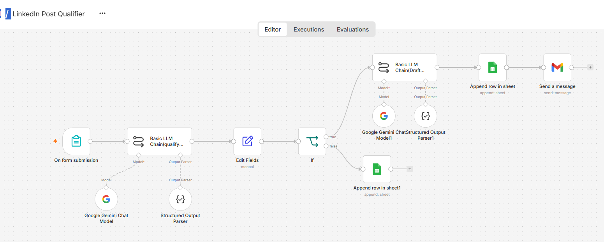
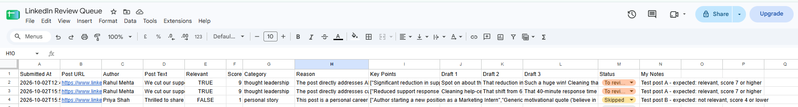

# LinkedIn Post Qualifier & Comment Drafter

An n8n automation that scores B2B LinkedIn posts with an LLM and drafts comment options for human review. Nothing is posted automatically.

## Problem
Sales and marketing teams waste time deciding which LinkedIn posts are worth engaging with. This workflow screens posts against the company's target audience and prepares comment drafts.

## How it works
1. A form takes the post URL, author, text and notes.
2. **Qualify Post** (Gemini, temperature 0.2) returns structured JSON: relevant, score (1-10), category, reason, key points.
3. **Check Score**: posts scoring 7 or higher go to **Draft Comments** (Gemini, temperature 0.7), which writes 3 comments (insightful, question, short).
4. Results are saved to Google Sheets with status To review, and a review email is sent. Lower-scoring posts are saved as Skipped.
5. A weekly digest workflow emails a summary, and an error workflow alerts on failures.

## Workflows
| File | Purpose |
|---|---|
| workflows/1-linkedin-post-qualifier.json | Main pipeline |
| workflows/2-linkedin-weekly-digest.json | Monday summary email |
| workflows/3-linkedin-error-alerts.json | Failure alerts |

## Tech stack
n8n Cloud, Google Gemini, Google Sheets, Gmail

## Screenshots

## Setup
1. Create a Google Sheet using the headers in `sheet-template.csv`. Add a Status dropdown: To review, Posted, Skipped.
2. In n8n, import each file via Workflows > Import from File.
3. Reconnect your own credentials: Google Gemini, Google Sheets, Gmail.
4. In the Google Sheets and Gmail nodes, select your sheet and set your email address.
5. Edit the company context in the system prompts (see `docs/prompts.md`).
6. Activate the workflows and use the form's Production URL.

## Design decisions
- **Human in the loop:** LinkedIn's terms prohibit automated commenting, so a person reviews and posts every comment.
- **Two AI steps:** one decides if a post is worth it, the second drafts comments only for qualified posts, which saves cost and keeps prompts focused.
- **Structured output:** a JSON parser forces fixed fields so later nodes work reliably.

## Results
[Add after the 15-post test: "X of 15 posts matched my expected labels (X%)". Delete this section if you have not run the test.]

## Limitations and future work
- Posts are pasted manually (no scraping of LinkedIn).
- No duplicate detection yet.
- Planned: full-stack version with a Next.js frontend, Supabase auth and database, and per-user company context.

## Author
[KinjlPandav] | [kinjlpandav@gmail.com]
